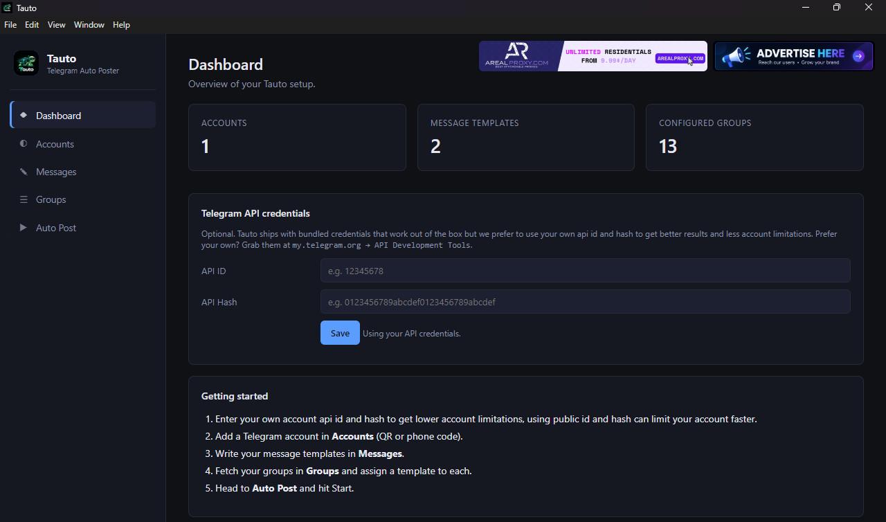

# Tauto — Telegram Auto Poster

A desktop app for scheduled, automated posting to Telegram groups across multiple accounts. Built for founders, community managers, and marketers who need to keep messages going out without babysitting the send button.

---

## What it does

- **Multi-account support** — log in with as many Telegram accounts as you need (QR code or phone OTP)
- **Reusable message templates** — text or photo-with-caption, Markdown supported
- **Group management** — fetch all your groups in one click, pick which ones to post to, assign templates per group
- **Forum topic support** — post directly into specific topic threads in supergroups
- **Human-like sending** — randomized delays, read receipts, and browsing behavior to keep accounts healthy
- **Live logs and stats** — watch sends, skips, and failures in real time
- **Runs in your background** — start it and forget it; stop anytime

---

## Download

Grab the latest installer from the [Releases](../../releases) page.

Available for **Windows** (`.exe` installer).
macOS and Linux builds coming soon.

---

## Getting started

1. **Install** Tauto using the installer.
2. **(Optional but recommended)** Add your own Telegram API ID and Hash from [my.telegram.org](https://my.telegram.org) — this reduces account limitations significantly compared to the bundled credentials.
3. **Add an account** — scan the QR code with your Telegram mobile app, or use phone + OTP.
4. **Create message templates** — write the messages you want to post, name them, and save.
5. **Fetch your groups** — one click pulls in every group your account can post to.
6. **Assign templates** — pick which template goes to which group, enable the ones you want, save.
7. **Hit Start** on the Auto Post screen.

---

## Why Tauto

Most Telegram automation tools are either sketchy web services that ask for your session string, or complicated Python scripts you have to babysit. Tauto is a native desktop app — your sessions never leave your computer, and it's built to be usable by anyone, not just developers.

---

## Terms of use

By using Tauto, you agree that:

- You are responsible for how you use this software
- You will comply with Telegram's Terms of Service and all applicable laws
- The developers are not liable for account restrictions, bans, or any consequences of misuse
- Any illegal, abusive, or policy-violating use is solely the user's responsibility

---

## Support

- **Bug reports and feature requests:** [Open an issue](https://t.me/TheRandomDeveloper)
- **General questions:** [Discussions](https://t.me/TheRandomDeveloper)

---

## Built by

[TheRandomDev](https://t.me/TheRandomDeveloper) — a small team building tools for the automation and proxy community.
